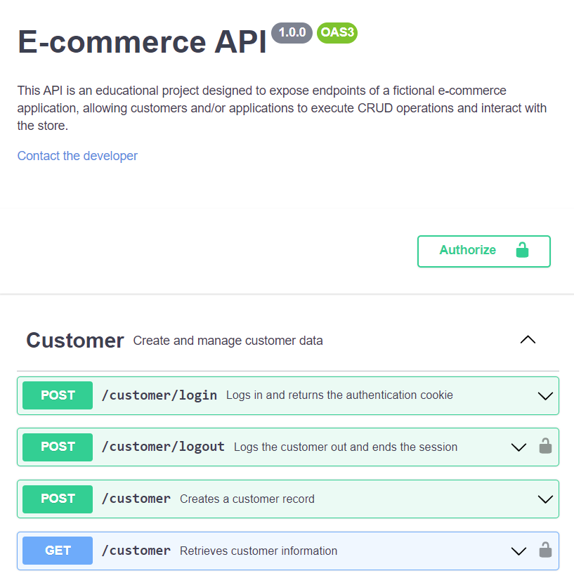

# E-commerce RESTful API

This project was built for Codecademy's Full Stack Engineering Path.

It's a RESTful API for a fictional e-commerce web application built with Node.js, Express.js and PostgreSQL.

The API exposes endpoints that provide basic functionality expected from an e-commerce app:

- User registration, login and data management.
- Categories and products data discovery and retrieval.
- Session tracking and shopping cart operations.
- Order creation and management.

The application was deployed to Heroku and is hosted at: https://ecommerce-api-pdafr.herokuapp.com/

The available endpoints and their documentation can be found [here](https://ecommerce-api-pdafr.herokuapp.com/api/docs).

The project's plan and other relevant documents can be found in the [docs folder](./docs).

## Technologies

* Node v16.13.2
* Express v4.18.1
* PostgreSQL v14.4

Libraries used for specific features:

* [Jest](https://github.com/facebook/jest): testing framework.
* [Supertest](https://github.com/visionmedia/supertest): HTTP assertions for endpoint testing.
* [Bcrypt](https://github.com/kelektiv/node.bcrypt.js): password hashing.
* [Express-session](https://github.com/expressjs/session): session management.
* [Passport.js](https://github.com/jaredhanson/passport): customer authentication.
* [Dotenv](https://github.com/motdotla/dotenv): environment variables loading.
* [Node-postgres](https://github.com/brianc/node-postgres): PostgreSQL client for Node.
* [Validator.js](https://github.com/validatorjs/validator.js): string validation and sanitization.
* [Helmet](https://github.com/helmetjs/helmet): middleware to configure security related HTTP headers.
* [Nodemon](https://github.com/remy/nodemon): automatic application restart on file changes for ease of development.

## OpenAPI Specification

The OpenAPI Specification for this project is in the [openapi.yaml](./api-specification/openapi.yaml) file. You can read and interact with the specification in [this link](https://ecommerce-api-pdafr.herokuapp.com/api/docs/).

## Database Schema

[Diagram on dbdiagram.io](https://dbdiagram.io/d/62bdd5c669be0b672c77022f)

The scripts for database setup can be found [here](./docs/database/scripts).

## Future Improvements

These features were considered during the planning phase of the project and might be included in future improvements:

- Alternative options for login (e.g., single sign-on with Google and Facebook).
- User reviews for products.
- Many-to-many relationship between products and categories.
- Detailed options and specifications for products (e.g. color, size, shipping options).
- Endpoints for product inventory and product discount management.
- Endpoints for customers to manage multiple shipping addresses.
- Administrative endpoints for categories, products, customers and orders remote data management.