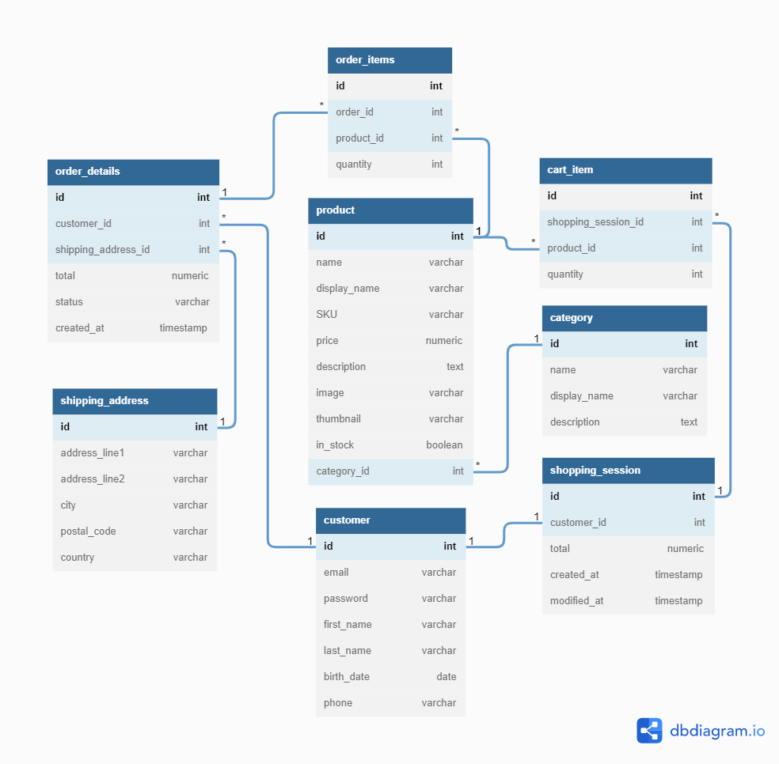

# E-commerce REST API Project Plan

## Table of Contents
1. [Summary](#summary)
2. [Implementation](#implementation)
3. [Development Methodology](#development-methodology)
4. [Database Schema](#database-schema)
5. [API Specification](#api-specification)

## Summary

The goal of this project is to develop a REST API for a fictional e-commerce web application using Node.js, Express and PostgreSQL.

The API will provide basic functionality expected from an e-commerce app: 

- User registration and login.
- Session tracking and shopping cart.
- Product search.
- Order placement.
- General endpoints for CRUD (Create, Read, Update, Delete) operations on the features listed above.

For simplification, it'll be assumed that payment processing is handled by a third-party and this API won't be concerned with those details.

Other features that were considered and might be included in future improvements to the project are: 

- User reviews for products.
- Many-to-many relationship between products and categories for a more dynamic and pleasant experience for users while browsing the products catalog.
- Detailed options and specifications for products (e.g. color, size, shipping options).
- Endpoints for product inventory and product discount management.
- Endpoints for customers to manage multiple shipping addresses and payment information.

## Implementation

A PostgreSQL database will comprise the data layer of the application. The database's schema will be designed using the [dbdiagram.io](https://dbdiagram.io/d) tool and the database will be implemented through the [psql](https://www.postgresql.org/docs/current/app-psql.html) CLI for PostgreSQL.

The application's server layer will be implemented on [Node.js](https://nodejs.org/en/) environment. [Express.js](https://expressjs.com/) will provide the server's basic routing functionality and useful middleware available for Express will provide session management ([express-session](https://expressjs.com/en/resources/middleware/session.html)) and authentication ([Passport.js](http://www.passportjs.org/)). The database integration will be handled by the [node-postgres](https://node-postgres.com/) library.

Regarding the API, a design first approach will be followed for its development since it's mission critical for the proper functioning of the application and should have the expected functionality well planned upfront. The [OpenAPI specification](https://github.com/OAI/OpenAPI-Specification/blob/main/versions/3.1.0.md) will be implemented with the help of [Swagger Editor](https://editor.swagger.io/) tool.

For testing, [Jest](https://jestjs.io/) will be used as the general test framework and the [SuperTest](https://github.com/visionmedia/supertest) library will assist with the API endpoint testing.

Finally, [Git](https://git-scm.com/) will be used as the project's version control system.

## Development Methodology 

The [Test-Driven Development (TDD)](https://en.wikipedia.org/wiki/Test-driven_development) methodology will be used in this project. While learning and practicing the writing of tests for previous projects, I gained a lot of insight into the value of testing. This project seems to be a good opportunity to leverage this experience and further practice testing on the server layer of an application.

## Database Schema

[Diagram on dbdiagram.io](https://dbdiagram.io/d/62bdd5c669be0b672c77022f)

[This article](https://fabric.inc/blog/ecommerce-database-design-example/) was of great help on how to design a database schema for an e-commerce application.

## API Specification

